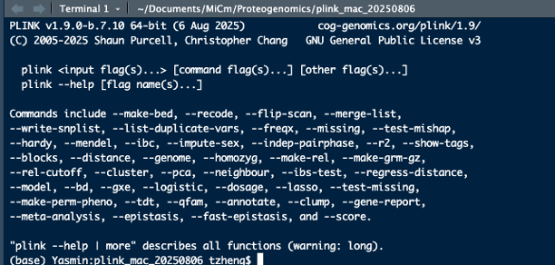
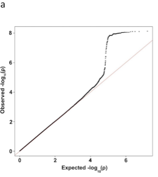

Welcome to the R Markdown for the Proteogenomics workshop!

```{r}
#Let's first load some libraries that we'll need to use for the first section of our workshop!

if (!requireNamespace("tidyverse")) {
    install.packages("tidyverse")
  }
  library(tidyverse)

if (!requireNamespace("ggpubr")) {
    install.packages("ggpubr")
  }
  library(ggpubr)

if (!requireNamespace("SomaDataIO")) {
    install.packages("SomaDataIO")
  }
  library(SomaDataIO)
```

Note: re-run this code block again to remove the install.packages output!

```{r}
#Let's set our working directory now so that we don't have to worry later!

#setwd(INSERT YOUR DIRECTORY HERE)
```

# Intro to Proteomics

## Somalogic Data Processing

```{r}
example_adat <- read_adat("../data/example_data_v5.0_plasma.adat")

#Do some basic exploration of the dataset

#Find the sex composition of the dataset

#Find the age composition of the dataset

#Are there NAs in the dataset?

#What does seq.10000.28 mean?
getAnalyteInfo(example_adat)


```

Here's the link: <https://menu.somalogic.com/> for easier access!

```{r}
example_olink <- read_delim("../data/20212016_Dube_NPX_2021-11-30.csv", delim = ";")

#Do some basic exploration of the dataset

#How many proteins are in this dataset?


#How many samples are there?


#Are there NAs in the dataset?


```

# Association Testing & Multiplexing

Welcome back! Let's work on our original Somalogic data set.

```{r}
#Our Somalogic dataset has some missing data; we could impute (predict) what the missing values should be but we will just remove them for this example.
rm(example_olink)

#This removes all participants with a missing Age (and coincidentally all participants with a missing Sex phenotype)
dataset <- example_adat %>% filter(!is.na(Age))

#In your actual datasets you might want to also check for missing Sex too!

#Let's do a correlation first!

ggplot(dataset, aes(x = Age, y = seq.10514.5)) + geom_point(alpha = 0.2)
```

Take a look at the y axis, this does not really *mean* anything. The units are arbitrary at the moment.

There's two ways for us to scale this data.

-   We could separate this into high and low (or even quartiles)

-   We could standardize this by subtracting the mean and dividing by the standard deviation

### Discrete sections

Let's try separating this into discrete sections first!

```{r}
#Let's just grab the "important" information right now

df <- dataset %>% select(c("SampleId", "Age","Sex","seq.10514.5", "seq.10464.6"))

#Seperates the proteins into High if they are above the median and Low if they are below
df$HighLow105 <- ifelse(df$seq.10514.5 > median(df$seq.10514.5),"High","Low")

#This allows us to run stats on strings
df$HighLow105 <- as.factor(df$HighLow105)


ggplot(df, aes(x = HighLow105, y = Age)) + geom_boxplot()

```

Hmmm, let's try running a t test to see how significant this association is!

```{r}
t.test(Age ~ HighLow105, df)
```

Wow! So we could report this finding as "Participants with protein levels above the median were on average 6.81 [95% CI: 3.21 to 10.41] years older than the participants with protein levels below the median (p-value = 0.0002645)."

Let's try looking at a protein that is associated with biological sex.

```{r}
#Seperates the proteins into High if they are above the median and Low if they are below
df$HighLow104 <- ifelse(df$seq.10464.6 > median(df$seq.10464.6),"High","Low")

#This allows us to run stats on strings
df$HighLow104 <- as.factor(df$HighLow104)

table(df$HighLow104,df$Sex)
```

Huh, looks like females are more likely to be associated with high protein levels!

We can test this with a chi-squared test!

```{r}
chisq.test(df$HighLow104,df$Sex)
```

Great! This one is less meaningful; but we can say something along the lines of "Female participants were significantly more likely to have higher protein levels (above the median) than Male participants (p-value = 0.006107)."

We can even test quartiles instead of just "High/Low", try running the same t-test and chi-squared tests on the quartiles! Here's an easy way to generate the quartiles!

```{r}
df$quartile105 <- cut(df$seq.10514.5,
                   breaks = quantile(df$seq.10514.5, probs = c(0, 0.25, 0.5, 0.75, 1), na.rm = TRUE),
                   include.lowest = TRUE,
                   labels = c("Q1", "Q2", "Q3", "Q4"))

table(df$quartile105)

#---Now try and run a t.test on age except compare Q4 and Q1-----


#Note that t-tests don't like it when you have more than 2 groups
  #Error in t.test.formula(Age ~ quartile105, df) : 
  #  grouping factor must have exactly 2 levels

#Report the p-value!


#---Using the code above, change it so that you split up seq.10464.6 into quartiles and compare Sex

#Report the p-value!
```

Okay, but running quartiles leads to us throwing away half of our data! What if we don't discretize our proteins?

### Scaling

There are two types of scaling that we will discuss in this workshop:

Z-score scaling and Inverse Normal Transformations (INT)

There are others that suit different methods or applications but we will just discuss these two for today!

INT is primarily used in GWAS so we'll discuss that during the pQTL section later on!

Z-score scaling transforms a value by subtracting the **mean of the variable** (e.g., that specific protein expression across individuals) and dividing by the **standard deviation**.\

A Z-score of 1 means the value is 1 standard deviation above the mean, making it easier to interpret how extreme or typical an observation is relative to the rest.

Luckily, R has a built in function, `scale()`, which does this for us!

```{r}
#Let's try scaling our seq.10514.5 instead of chunking it!
df <- dataset %>% select(c("SampleId", "Age","Sex","seq.10514.5", "seq.10464.6", "seq.10527.22", "seq.10438.19", "seq.10440.26"))

df$scaled_105 <- scale(df$seq.10514.5)

#We should make this into a factor so that our regression can deal with it
df$Sex <- as.factor(df$Sex)

#Now let's see the correlation

cor(df$Age, df$scaled_105)

#We can even get the p-value like so:

cor.test(df$Age, df$scaled_105)

#Keep in mind, that the correlation is only 0.37, which means that the R^2 is only

cor(df$Age, df$scaled_105)^2

#So Age only explains 14% of the variance found in the protein

ggplot(df, aes(x = Age, y = scaled_105)) + geom_point(alpha = 0.5) + stat_cor() + geom_smooth(method = "lm", formula = y ~ x, se = FALSE, color = "red") 

#This stat_cor is from the ggpubr package and is really convienent!
```

Great! But correlation testing isn't the *best* way of looking at this information.

Let's go back to the PowerPoint!

### Linear Regression

The function for linear regressions is a simple `lm()`.

```{r}

lm(Age ~ scaled_105, df)

#We can get more information out of the model if we do the following

linear_105 <- lm(scaled_105 ~ Age, df)
summary(linear_105)
```

What does this mean?

Residuals are the difference between the observed value and the line of best fit. We want to make sure they are normally distributed (Median around 0, 1Q and 3Q are close in magnitude to one another)

Coefficents are the actual "meat" of the regression. This tells us that at the y-intercept, the estimated value of our protein is -1.73 SD from the mean AND that for every year older, on average the protein level is 0.03 SD higher.

Most of the time, the intercept isn't meaningful for proteomics since adults and infants have different proteomic profiles and you can't have a 0 year old adult.

The **slope for Age (0.031)** means that for every additional year of age, the protein level (`scaled_105`) increases by **0.031 standard deviations**, on average.

The Std. Error or Standard Error reflects the **uncertainty** or **variability** in the estimated coefficient. A smaller SE means we're more confident in the precision of our estimate.

This is also reflected in our t value (coming from a t-distribution), and the p-value.

Our overall formula would look something like this:

$$
\text{scaled_105} = -1.733 + 0.03097 \times \text{Age}
$$

This also works for Categorical variables such as Sex.

Try running a linear regression on Sex and our other protein in df `seq.10464.6`.

```{r}

#First scale seq.10464.6


#Next, run a basic linear regression comparing Sex to seq.10464.6


#What does SexM mean? 


```

### Multivariate Linear Regression

Normally you will have more variables than just Age and Sex in your model. In statistical modeling, such as in biomedical or epidemiological research, it's common and important to include multiple variables in a linear regression model, such as Age, Sex, and other potential confounders or covariates (BMI, sampling location, genetic ancestry, etc). This can be counterintuitive if you're coming from a machine learning perspective, where adding too many variables (especially irrelevant or redundant ones) can lead to overfitting and reduced generalization performance. The goals differ: statistical models often prioritize *interpretability and causal insight*, while machine learning models typically prioritize *prediction accuracy*.

However, in this dataset, we will just use Age, Sex, and we'll even include an interaction term!

Let's take a look back at `seq.10514.5` but this time let's look the model when we include both Age and Sex as variables.

```{r}
multi_linear_105 <- lm(scaled_105 ~ Age + Sex, df)
summary(multi_linear_105)
```

Okay, lets break down what this means.

```         
scaled_105 ~ Age + Sex, data = df
```

Means we are seeing how both Age AND Sex correlate with the data

```         
Residuals:
    Min      1Q  Median      3Q     Max 
-1.9851 -0.5978 -0.0543  0.4452  4.3063 
```

The residuals still look relatively normally distributed, which is promising

```         
Coefficients:
             Estimate Std. Error t value Pr(>|t|)    
(Intercept) -1.784327   0.357859  -4.986 1.59e-06 ***
Age          0.031151   0.006058   5.142 7.86e-07 ***
SexM         0.082932   0.146185   0.567    0.571
```

It looks like Age is still significantly associated with protein levels (sometimes adding a co-variate can increase the p-value; especially if the added co-variate explains more of the variation in the data.

But, it looks like Sex is NOT associated with protein level. In fact, SexM means that our baseline is female; and that changing it from Female to Male, does not significantly change the protein levels.

Let's look at `seq.10527.22` now instead!

```{r}

#Scale seq.10527.22
df$scaled_1052 <- scale(df$seq.10527.22)
#Run a multi-variate linear regression

#Read out the summary

```

You *should* see something like this:

```         
Residuals:
    Min      1Q  Median      3Q     Max 
-0.6154 -0.2467 -0.1013  0.0454 11.7777 
```

Woah, that's a crazy max value, I wonder what's happening here. One way we can check is through using the functions

`qqnorm() and qqline()`

```{r}
#qqnorm(residuals(YOUR_MODEL_HERE))
#qqline(residuals(YOUR_MODEL_HERE))
```


You should see something like this plot appear. This is known as a Q-Q plot which stands for Quantile-Quantile plot. This specific plot is comparing how a normal distribution looks like compared to the actual distribution of the residuals (keep in mind you can also run this on your actual data too). The line that you see here shows the identity, or where your residuals *should* be if everything was normal.

As you can see here, it looks like we have a couple of outliers, especially at the top. Let's see what it looks like as a plot!

```{r}
ggplot(df, aes(x = Age, y = scaled_1052, colour = Sex)) + geom_point(alpha = 0.2)
```

Well then, I think we found our outlier!

This is actually a bad practice to run your analysis *and then* look for outliers. A better practice would be to fix this right after scaling, many people will either cap out outliers (max of 3 or 4) or will exclude them from the data. Let's try excluding them now.

```{r}
df$scaled_1052 <- ifelse(df$scaled_1052 > 4|df$scaled_1052 < -4, NA, df$scaled_1052)
table(is.na(df$scaled_1052))
```

Looks like we just removed one sample anyways!

Let's re-run our analysis now.

```{r}
multi_linear_1052 <- lm(scaled_1052 ~ Age + Sex, df)
summary(multi_linear_1052)
```

Whoops, so looks like that singular outlier was driving all of the significant associations!

Let's check out another example that actually works. `seq.10440.26`

```{r}
df$scaled_1044 <- scale(df$seq.10440.26)
df$scaled_1044 <- ifelse(df$scaled_1044 > 4|df$scaled_1044 < -4, NA, df$scaled_1044)
multi_linear_1044 <- lm(scaled_1044 ~ Age + Sex, df)
summary(multi_linear_1044)
```

Hmmm, let's check the QQ plot

```{r}
qqnorm(residuals(multi_linear_1044))
qqline(residuals(multi_linear_1044))
```

Still not a perfect fit, in fact; let's check the histogram of our original dataset.

```{r}
hist(df$scaled_1044)
```

Ahh, as you can see, our original data was not normally distributed which can lead to these problems. We'll discuss a way to deal with this - but what this does mean is that while our betas or effect sizes are accurate; our p-values may be inaccurate. Thankfully, we have enough observations that through the law of large numbers, we can still be fairly confident in our p-values (although we will also discuss why p-values are a can of worms in of itself).

```         
Coefficients:
             Estimate Std. Error t value Pr(>|t|)    
(Intercept) -1.390404   0.336254  -4.135 5.73e-05 ***
Age          0.027389   0.005704   4.802 3.61e-06 ***
SexM        -0.331562   0.137632  -2.409   0.0171 *  
```

Okay, so what do these coefficients mean?

Well, our model is telling us that for every one year older a participant is, they **on average** have an increased protein level of 0.027 standard deviations. Meanwhile, if they are a male as opposed to a female, then they will be -0.33 standard deviations lower to begin with. You can visualize this as:

$$
\text{scaled_1044} = -1.39 + 0.0274 \times \text{Age } + -0.3316 \text{ if Sex = Male} 
$$


In this case, our men in our sample would be "Group B" while our women would be "Group A".

### Interaction terms

Okay, now that we tried having more than one variable, what if they interact with each other? For example, what if Age was only associated with protein levels in Men but not Women?

We can change that by adding in the term $Sex*Age$ into our regression.

```{r}
multi_linear_interaction_1044 <- lm(scaled_1044 ~ Age + Sex + Age*Sex, df)
summary(multi_linear_interaction_1044)
```

This is an instance of adding an additional covariate results in the loss of significance for another covariate!

```{r}
#Now try on your own to make a multivariable regression with an interaction term with seq.10438.19

#Also, try without the interaction term and examine what happens to the significance. Why do you think that occurred?

```

## Problems associated with multiple comparisons

Let's look at running a bunch of linear regressions together!

```{r}
#Try and write some code that will
#a) scale AND remove the outliers from every single protein tested
#b) Run a linear regression with Age, Sex, and Age*Sex for each single protein


```

```{r eval=FALSE, include=FALSE}
regression <- dataset %>% select(c("Age","Sex"))
regression_protein <- dataset %>% select(starts_with("seq"))
scaled_protein <- regression_protein %>% mutate_all(~ {
    scaled <- scale(.) %>% as.vector()
    ifelse(scaled > 4 | scaled < -4, NA, scaled)
  })

regression <- cbind(regression, scaled_protein)

rm(regression_protein)
rm(scaled_protein)

metrics <- list()

regression$Sex <- as.factor(regression$Sex)

for(i in 3:163){
  form <- paste0(colnames(regression)[i], " ~ Age + Sex + Age*Sex")
  summ_regression <- lm(form, regression)  
  summary_regression <- summary(summ_regression)
  Age_pval <- summary_regression$coefficients[2, "Pr(>|t|)"]
  Age_beta <- summary_regression$coefficients[2, "Estimate"]
  Age_se <- summary_regression$coefficients[2, "Std. Error"]
  
  Sex_pval <- summary_regression$coefficients[3, "Pr(>|t|)"]
  Sex_beta <- summary_regression$coefficients[3, "Estimate"]
  Sex_se <- summary_regression$coefficients[3, "Std. Error"]
  
  Age_Sex_pval <- summary_regression$coefficients[4, "Pr(>|t|)"]
  Age_Sex_beta <- summary_regression$coefficients[4, "Estimate"]
  Age_Sex_se <- summary_regression$coefficients[4, "Std. Error"]
  
  metrics[[i]] <- list(name = colnames(regression)[i],
                      Age_pval = Age_pval,
                       Age_beta = Age_beta,
                       Age_se = Age_se,
                      Sex_pval = Sex_pval,
                       Sex_beta = Sex_beta,
                       Sex_se = Sex_se,
                      Age_Sex_pval = Age_Sex_pval,
                       Age_Sex_beta = Age_Sex_beta,
                       Age_Sex_se = Age_Sex_se
                      )
}

metrics_df <- bind_rows(metrics)

which.min(metrics_df$Age_pval)
which.min(metrics_df$Sex_pval)
which.min(metrics_df$Age_Sex_pval)

metrics_df$name[138]
metrics_df$name[108]
metrics_df$name[12]

metrics_df$Age_Sig <- metrics_df$Age_pval < 0.05
metrics_df$Sex_Sig <- metrics_df$Sex_pval < 0.05
metrics_df$Age_Sex_Sig <- metrics_df$Age_Sex_pval < 0.05

smaller <- metrics_df[metrics_df$Age_Sig & metrics_df$Sex_Sig,]

smaller

ggplot(regression, aes(x = Age, y = seq.10438.19, colour = Sex)) + geom_point(alpha = 0.2)

```

Now you have a bunch of p-values; how many are significant? We can plot this as a volcano plot, where we use the betas or effect sizes as the x-axis and the p-values as the y-axis.

```{r}
metrics_df <- readRDS("../data/data.rds")

ggplot(metrics_df, aes(x = Age_beta, y = Age_pval)) + geom_point(alpha = 0.5)
```

Normally, you see this inverted and the y-axis scaled to a log axis.

```{r}
ggplot(metrics_df, aes(x = Age_beta, y = -log(Age_pval, base = 10), colour = Age_Sig)) + geom_point(alpha = 0.5)
```

Let's try applying both Bonferroni and FDR.

```{r}
metrics_df$Age_pval_Bon <- p.adjust(metrics_df$Age_pval, method = "bonferroni")

table(metrics_df$Age_pval_Bon < 0.05)
```

Wow, we lost all of our significant results except for the top two!

```{r}
metrics_df$Age_pval_FDR <- p.adjust(metrics_df$Age_pval, method = "fdr")

#How many associations do we keep with FDR?
```

Let's recolour our significant hits using this method instead and plot it!

```{r}
#Add or change a significance column

#Re-draw the ggplot
```

Now let's do the same thing but for Sex and our Age\*Sex interaction

```{r}

```

# Protein Quantitative Trait Loci

Okay, so we have our genetic data found here `Exercises/data`

We're not going to open the bed file, since it is in binary; but let's open up the .bim and .fam files

```{r}
bim <- read_delim("../data/ToyData.bim", col_names = F, col_types = "iciicc")
#The way bim files are created is with 6 columns and n rows; n = number of variants

dim(bim)

head(bim)
```

As you can see, we have 10,000 variants and 6 columns

| Chromosome | Variant ID | Genetic Position | Base Pair | Alternate Base | Reference Base |
|----|----|----|----|----|----|
| 1 | 1:23613 | 0 | 23613 | T | C |

: Example .bim file

Due to this being a toy dataset, I have left the genetic position empty, the variant ID as the chromosome and base pair (opposed to the rsID) and kept the same Alternate and Reference Bases for each variant.

Now let's look at the .fam file

```{r}
fam <- read_delim("../data/ToyData.fam", col_names = F)
```

.fam files also have 6 columns but this time the number of rows are the number of samples or individuals you have in your dataset

| Family ID | Individual ID | Father's IID | Mother's IID | Sex | Phenotype |
|-----------|---------------|--------------|--------------|-----|-----------|
| Ind80     | Ind80         | 0            | 0            | 2   | -9        |

Because this again is a toy dataset, we are not dealing with a genetic repository that has any family structure (Where a child and their two parents and found in the same dataset). That leads the first, third, and fourth columns irrelevant for our work. Sex is coded as ('1' = male, '2' = female, '0' = unknown) in PLINK so just keep that in mind compared to a 0/1 coding that other places use. Finally, the phenotype is coding -9?

```{r}
table(fam$X6)
```

-9 in PLINK means missing data; so for us we will need to manually add our phenotype that we want to test.

Let's look at `seq.10527.22`

```{r}
#Now we have a variable that is scaled so we can just do something like:
#fam$X6 <- df$scaled_1052

#But wait! Let's check if the IDs are the same

print(df$SampleId)
print(fam$X1)

#This happens all the time, but is an easy fix!

df$SampleId <- paste0("Ind",df$SampleId)

#Now we have...

print(df$SampleId)

#dplyr has a really convienent function to add only what we need to a dataframe in the order we need

dfkey <- df %>% select(c("SampleId","scaled_1052"))

newfam <- left_join(fam, dfkey, by = c("X1" = "SampleId"))

newfam <- newfam[,-6]

newfam[,6] <- unlist(newfam[,6])

#This might overwrite your fam file - save your old file somewhere else if you want a backup
write_delim(newfam,"ToyData.fam",col_names = F)
#For me at least, the file is written to the directory of the .Rmd which is different from my working directory.
```

### Let's go to PLINK with our files now!

We can even do this in RStudio's Terminal! (Windows users, please let us know if you cannot run it)

If you have not run PLINK before, or just downloaded it; you might need to go to your settings to allow running an "unknown application"

In the terminal run:

`./plink` and you should see the following:



We can do a *super simple* association by just running the following:

`./plink --bfile ../QLS-MiCM-Proteogenomics/Exercises/data/ToyData --assoc`

You can change the file directories by running it from the data file set and just giving the path for PLINK but this way everyone should be able to run it.

But, this does not take into account covariates such as Age and Sex; for that we need to make a covariate file

```{r}
covar <- df %>% select(c("SampleId","Age"))

#PLINK needs both an FID and an IID column so

covar$FID <- covar$SampleId
covar <- covar %>%  rename(IID = SampleId)

covar <- covar %>% select(c("FID","IID", "Age"))

write_delim(covar, "covar.txt")
```

Now try running this command:

`./plink --bfile ../QLS-MiCM-Proteogenomics/Exercises/data/ToyData --linear sex --covar ../QLS-MiCM-Proteogenomics/Exercises/scripts/covar.txt`

We used the sex option after linear but could have easily just added Sex as a covariate in covar.txt

Again, most of the time, we would also have other covariates such BMI, Smoking Status, Sampling Centre, or other meaningful covariates.

### Let's come back to R!

Let's read the association:

```{r}
Result <- read_table("../../../plink_mac_20250806/plink.assoc.linear", col_types = "iciccdddd")
```

You can ignore this warning about a tenth column but if it bugs you, go into the .linear file and delete the whitespace after P

First thing you can see here is it also does a test on the covarites; but we're going to just look at the additive genotypic test

```{r}
table(Result$TEST)

Add_result <- Result[Result$TEST == "ADD",]
```

We can even run a QQ-plot on this model, just like we did on our linear models!

```{r}
#Let's see how inflated our GWAS is
#We're going to use ggfastman to run our analysis
if (!requireNamespace("devtools")) {
    install.packages("devtools")
  }
if (!requireNamespace("ggfastman")) {
    devtools::install_github("roman-tremmel/ggfastman", upgrade = "never")
  }
library(ggfastman)

fast_qq(Add_result$P)
```

This isn't telling us what the distribution of the residuals are; this plot is showing us how the p-values are distributed.\
\
This is an ideal scenario with most of the dots following the red line and a single dot going way above the axis; meaning we have one significant SNP.

In all honestly, if I were to see something like this result in a real dataset that was not already pruned - I would be sceptical. I would expect to see something more like the following.

{width="386"}

This is because we would expect SNPs that are geographically close to one another to have similar effect size due to Linkage Disequilibrium.

Finally, we can also run a Manhatten Plot on our GWAS results to see how it looks like.

```{r}
colnames(Add_result)
#fast_manhatten needs chr, pos, pvalue 
colnames(Add_result)[c(1,3,9)] <- c("chr", "pos", "pvalue")

fast_manhattan(Add_result)
```

Again, this is not typical of a manhatten plot since we normally would have 1 million+ SNPs across 22 - 23 chromosomes. This would be more typical.


Regardless, let us keep going with our analysis for now.

```{r}
#Find the smallest p-value
#Which SNP is it located in?
#What does the effect size mean?

#What is this protein?
```

Normally you would then try to find the *cis* region of all of your proteins of interest. The easiest way is to just use ensembl, uniprot, or any other platform to find the cis region.

Now it's time for you to do your own work.

Find what this SNP does, does the effect size with the mutation make sense? Is this a cis or trans pQTL?

```{r}


```

Thank you for attending this workshop, if you have any questions feel free to address them to me at thomas.zheng\@mail.mcgill.ca or reach out to the QLS-MiCM email!
